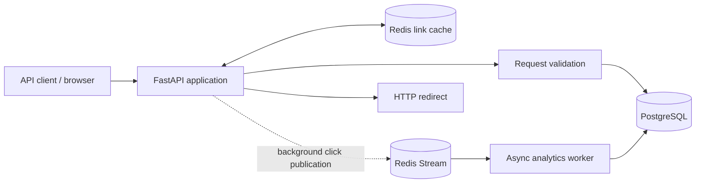
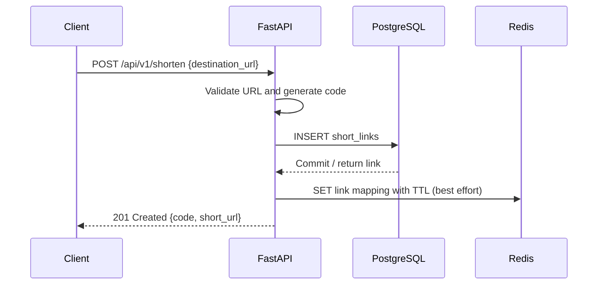
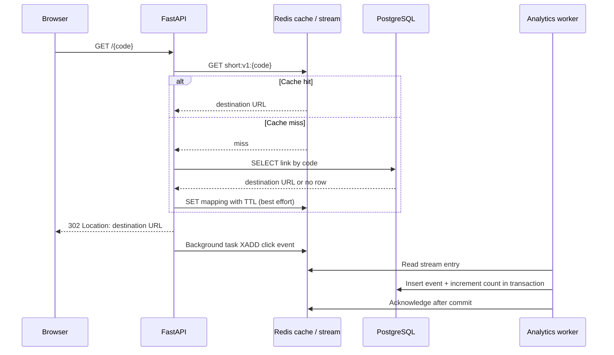

# URL Shortener - Engineering Design

**Status:** Proposed design for review  
**Scope:** Mandatory URL-shortener use case  
**Stack constraints for this design:** Python 3.11+, FastAPI, SQLAlchemy 2.0 async, PostgreSQL, and Redis

## 1. Goals and Assumptions

This design covers link creation, persistent storage, redirects, and click analytics. PostgreSQL is the source of truth. Redis is a disposable lookup cache and, for the proposed analytics flow, a Redis Stream transport. The performance targets in Section 9 are design inputs, not results already demonstrated by a benchmark.

The requirement analysis currently says that no stack is mandated. This design treats the stack listed in the design request as a constraint for this architecture only. If the stack is intended to be a confirmed project requirement, update the requirement analysis and approval record separately.

The service does not fetch destination URLs; it validates and stores them, then redirects visitors. Only absolute `http` and `https` destinations are accepted. Authentication, custom aliases, link updates/deletion, expiration, and analytics retention require separate product decisions and are not included in the minimum behavior.

## 2. High-Level Architecture

### Components

- **FastAPI application:** Provides link creation, redirect, and analytics endpoints. Request handlers use asynchronous SQLAlchemy sessions and Redis clients.
- **PostgreSQL:** Stores short-link mappings, aggregate click counts, and click events. It remains authoritative when the cache is empty or unavailable.
- **Redis cache:** Holds frequently resolved short-code mappings with a finite TTL. Cache loss affects performance, not correctness.
- **Redis Stream and analytics worker:** Buffers click events for asynchronous persistence. The worker uses a consumer group, stores each event, updates the link's aggregate count, and acknowledges the event after the database transaction commits.

## 3. Data Flows

### 3.1 Creation

1. Client calls `POST /api/v1/shorten` with a destination URL.
2. FastAPI validates that the URL is absolute and uses the `http` or `https` scheme.
3. The service generates a random Base62 short code and inserts the mapping into PostgreSQL. A unique constraint protects against collisions; on conflict, the service generates another code and retries a bounded number of times.
4. After the database commit, the service writes the mapping to Redis with the configured TTL. Cache write failure is logged and metered but does not fail an already-committed creation.
5. The API returns `201 Created` with the short code and short URL.

### 3.2 Redirection and Analytics

1. Browser calls `GET /{code}`.
2. FastAPI looks up `short:v1:{code}` in Redis.
3. On a cache miss, it reads PostgreSQL and populates Redis. An unknown code returns `404 Not Found`.
4. For a known code, the service schedules a FastAPI background task to publish a click event to the Redis Stream, then returns a `302 Found` redirect to the stored URL. A temporary redirect avoids browsers permanently caching the mapping and bypassing future analytics.
5. An analytics worker reads the stream. In one PostgreSQL transaction it inserts the event idempotently and increments the link's total click count only if the event was newly inserted. It acknowledges the stream entry only after commit.
6. `GET /api/v1/links/{code}/analytics` reads the aggregate count; optional time-series reporting can query the event table using its link-and-time index.

The task is scheduled as part of the response handling; a process crash before the background task publishes the event can lose that click. This is an explicit best-effort trade-off for the prototype. If analytics must be loss-resistant, publish the event to the stream synchronously before returning the redirect, or use a transactional outbox and a dispatcher. In either case, keep PostgreSQL work out of the redirect's critical path where possible.

## 4. Proposed API Surface

| Method and path | Behavior | Success / errors |
|---|---|---|
| `POST /api/v1/shorten` | Validate and create a short link. Request body: `{"destination_url":"https://example.com/path"}` | `201` with `code`, `short_url`, and `created_at`; `422` for invalid input; `503` if persistence is unavailable. `short_url` uses the configured `URL_SHORTENER_PUBLIC_BASE_URL` origin. |
| `GET /{code}` | Resolve a short code and redirect. | `302` with `Location`; `404` only after PostgreSQL confirms no mapping; `503` when the database lookup fails. |
| `GET /api/v1/links/{code}/analytics` | Retrieve click analytics. | `200` with at least `code` and `clicks_total`; `404` for an unknown code. |

Errors use the JSON shape `{"error":{"code":"...","message":"...","details":...}}`. Authentication and rate limiting are not specified by the assignment and must be decided before exposing the service publicly.

## 5. PostgreSQL Schema

### `short_links`

| Column | Type | Constraints / purpose |
|---|---|---|
| `id` | `BIGINT GENERATED ALWAYS AS IDENTITY` | Primary key used by internal foreign keys. |
| `code` | `VARCHAR(16)` | Not null, unique; public short code. Generate 8 random Base62 characters initially; retry on uniqueness conflict. |
| `destination_url` | `TEXT` | Not null; validated absolute HTTP(S) URL. |
| `created_at` | `TIMESTAMPTZ` | Not null, default `now()`. |
| `clicks_total` | `BIGINT` | Not null, default `0`; updated by the analytics worker. |

### `click_events`

| Column | Type | Constraints / purpose |
|---|---|---|
| `event_id` | `UUID` | Primary key; generated when the click event is created and used for idempotency. |
| `link_id` | `BIGINT` | Not null; foreign key to `short_links.id`. |
| `clicked_at` | `TIMESTAMPTZ` | Not null; event time in UTC. |

Do not store IP addresses or user-agent values in the initial design; they are not required and create privacy and retention obligations.

### Indexes and query rationale

- Unique B-tree index on `short_links(code)` supports both collision prevention and direct code lookup. PostgreSQL creates this index for the unique constraint.
- Primary key on `short_links(id)` supports the event foreign key and worker updates.
- Primary key on `click_events(event_id)` makes event processing idempotent.
- Composite B-tree index on `click_events(link_id, clicked_at DESC)` supports per-link time-range analytics.
- Avoid extra indexes until a query or measured workload requires them; each index adds write and storage cost.

For high event volume, time partitioning and retention/archival can be introduced after defining analytics retention requirements. The aggregate `clicks_total` provides a low-cost total-count response; time-series analytics use the event table.

## 6. Redis Cache and Telemetry

### Link cache

- **Key:** `short:v1:{code}`
- **Value:** Compact serialized mapping containing `link_id` and `destination_url`.
- **TTL:** Start with a configurable one-hour TTL (`LINK_CACHE_TTL_SECONDS=3600`); tune using observed hit rate, database load, and any future update/expiration semantics.
- **Policy:** Cache-aside on redirect; populate after a database miss. Populate after successful creation as a best effort. PostgreSQL remains authoritative.
- **Outage behavior:** A Redis cache read/write failure falls back to PostgreSQL. Emit a metric and structured log; do not return a false 404 because the cache is unavailable.
- **Invalidation:** Links are immutable in this baseline, so TTL bounds staleness. If link edits, deactivation, or deletion are added, invalidate the cache after the database commit.

### Click event stream and worker

- FastAPI `BackgroundTasks` publishes a minimal event (`event_id`, `link_id`, `clicked_at`) to a Redis Stream after the redirect response is sent.
- A separate async worker consumes through a Redis consumer group. It commits the event insert and counter increment in a single PostgreSQL transaction, then acknowledges the stream item.
- Retry consumer-group initialization and stream operations after Redis connection failures so the independently run worker can recover without an external restart.
- The worker uses `XAUTOCLAIM` and `XTRIM MINID`, requiring Redis 6.2 or newer.
- If a worker fails before commit, the item remains pending for retry. The unique `event_id` prevents duplicate increments on retry. Configure pending-entry recovery and monitor stream lag.
- Check trimming periodically, not after every worker batch. Trim only an acknowledged prefix, bounded by the oldest pending entry and the configured recent-entry window. Cache the boundary only when it actually limits the trim; if the recent-entry retention boundary limits it, recheck that boundary on the next scheduled trim. Never trim unprocessed or pending events; a stalled entry may therefore cause the stream to exceed its target maximum length. This prototype policy is count-based, and production retention should be reviewed against analytics and Redis durability requirements.
- Redis persistence and replication should be configured to match the required durability; Redis is not a substitute for the PostgreSQL record.
- Monitor background publish failures, pending event count, processing lag, database transaction failures, and rejected/invalid destination URLs.

## 7. Runtime and Failure Handling

- Use one async SQLAlchemy engine per application process, an async connection pool, and a request-scoped `AsyncSession`; always close sessions after use.
- Reuse an async Redis client/connection pool per process. Keep pools and worker counts configurable so total connections remain within PostgreSQL and Redis limits.
- Apply bounded timeouts to database and Redis operations. Return a service error when PostgreSQL cannot create or resolve a link; for cache failures, fall back to PostgreSQL.
- The cache may be flushed or unavailable without data loss. Redis Stream loss or failure to publish a background click can lose analytics under the best-effort baseline; expose this limitation and alert on it.
- Run the analytics worker independently from API workers so stream processing can scale separately.

## 8. Security, Scaling, and Observability

- Accept only absolute HTTP and HTTPS destinations; reject malformed URLs and other schemes. The service does not dereference the destination during creation, reducing server-side request forgery exposure.
- Use parameterized SQL through SQLAlchemy, keep credentials in environment/secret management, and avoid logging full URLs if they may contain sensitive query values.
- Random codes reduce easy enumeration compared with sequential identifiers, but do not replace authentication, abuse prevention, or rate limiting.
- Scale API processes horizontally behind a load balancer; PostgreSQL and Redis are shared services. Use pool sizing, database query monitoring, and cache hit-rate measurements to find bottlenecks.
- Add structured request logs and metrics for create/redirect/analytics latency, status codes, cache hit/miss/error counts, code collision retries, database pool utilization, event enqueue errors, and worker lag. Do not use the short code or destination URL as high-cardinality metric labels.

## 9. Performance & Scale Targets

| Target | Required value | Architectural implication |
|---|---:|---|
| Redirect-to-create ratio | 100:1 | Optimize the read/redirect path independently from link creation; make redirects cache-first. |
| Peak redirects | Approximately 1,000 requests/second | Serve common lookups from Redis and keep database/cache I/O asynchronous so requests do not block worker threads while waiting on network I/O. |
| Peak shortening | Approximately 10 requests/second | Keep the creation path transactional and indexed; PostgreSQL is the authoritative mapping store. |
| Redirect latency | P95 <= 50 ms for `GET /{short_code}` | Avoid a PostgreSQL round trip on cache hits and keep telemetry persistence out of the redirect response path. |
| Shortening latency | P95 <= 200 ms for `POST /api/v1/shorten` | Validate, generate a code, perform one indexed insert, commit, and return; Redis population is best effort after commit. |

### How the targets inform the stack

- **FastAPI:** Its ASGI request handling and async endpoint support suit the I/O-bound redirect workload. Awaiting Redis/PostgreSQL calls does not occupy a thread per waiting request, helping serve high concurrency. FastAPI does not itself guarantee the P95 targets; worker count, event-loop blocking, payload size, and deployment must be benchmarked.
- **SQLAlchemy 2.0 async:** Async database I/O and a bounded connection pool let cache misses, link creation, and analytics persistence share PostgreSQL without blocking the event loop. Pool sizing and timeouts must be tuned so a burst of cache misses or telemetry work does not exhaust connections.
- **PostgreSQL:** Provides durable mappings, unique-code enforcement, indexed lookup, and transactions. At the target workload, link creation is about 10 RPS; the much larger redirect volume should not all become database reads. PostgreSQL still receives cache misses and analytics writes, so the analytics worker must be load-tested at the event rate and should batch inserts/counter updates if per-event transactions become a bottleneck.
- **Redis:** Cache-aside lookup avoids most PostgreSQL reads on the 1,000-RPS redirect path; the finite TTL bounds cache staleness. Redis Streams can decouple click-event handling from response latency. Redis is not the source of truth, and background publication is best effort unless upgraded to synchronous enqueue or an outbox.

### Measurement and capacity validation

- Run a load test with approximately 1,000 valid redirects/second and 10 creations/second (100:1), using a realistic short-code distribution that includes popular links.
- Measure request latency at the service boundary. Report P95 separately for successful `GET /{short_code}` and `POST /api/v1/shorten`; include test duration, warm-up, concurrency model, environment, cache state, and error rate.
- Exercise warm-cache hits, cold-cache misses, and Redis failure separately. A cache hit ratio is a key diagnostic for the redirect P95, but no numeric hit-ratio target is specified.
- Measure database pool utilization, PostgreSQL query latency, Redis latency, analytics stream lag, worker throughput, and dropped/enqueue-failed events under the same load. A redirect test that omits telemetry does not validate the full design.
- Treat the stated rates and P95 values as acceptance targets, not measured results. Record actual benchmark results in testing documentation before claiming the targets are met.

## 10. Design Trade-Offs

| Decision | Rationale | Trade-off / limitation |
|---|---|---|
| PostgreSQL is source of truth; Redis is cache | Preserves correctness on cache misses and allows cache eviction/rebuild. | Redirect cache misses add a database read; cache outage increases database load. |
| Random Base62 code with unique constraint and retry | Avoids exposing sequential IDs and handles collisions safely. | Code length and retry limits are design parameters; collisions must be monitored. |
| Cache-aside with a one-hour configurable TTL | Simple and resilient for immutable mappings. | Changes would be stale until invalidation or TTL expiry. |
| FastAPI background task publishes analytics to Redis Stream | Keeps PostgreSQL event writes outside the redirect's critical path and supports asynchronous consumers. | A process failure before publish can lose a click; use synchronous stream publication or an outbox if loss is unacceptable. |
| Aggregate click count plus raw event table | Fast total-count response while preserving data for time-based reporting. | Counter is eventually consistent; raw event storage requires a retention/partitioning policy. |
| `302 Found` redirects | Temporary redirect avoids permanent client caching and supports measuring repeat visits. | Adds a service request on each visit; clients may still cache according to headers. |

## 11. Decisions Required Before Production

- Benchmark environment, duration, warm/cold cache criteria, availability target, and analytics data retention period.
- Whether analytics may be best-effort or must be loss-resistant.
- Authentication, rate limiting, abuse reporting, and administrative link controls.
- Expiration, deletion, custom aliases, and link update semantics.
- Whether analytics needs per-day breakdowns, and which data may be collected.
- Production Redis durability, PostgreSQL backup/restore, migration, and deployment strategy.

## 12. Verification Plan

Before implementation, map tests to the requirements. During implementation, verify:

- URL validation, successful creation, unique-code collision retry, and persistence across application restart.
- Redirect for an existing code, `404` for an unknown code, cache hit, cache miss, and Redis cache outage fallback.
- Analytics event publication, worker persistence, idempotent retry, aggregate count, and behavior when background publishing fails.
- Async session lifecycle, API error formats, and endpoint contract with integration tests against PostgreSQL and Redis.
- Peak-load behavior at the Q-6 rates and Q-7 P95 limits, including cache-hit and cache-miss cases and analytics processing at the corresponding event rate.

Record actual commands and results in the testing documentation; this design does not claim those tests have already been run.